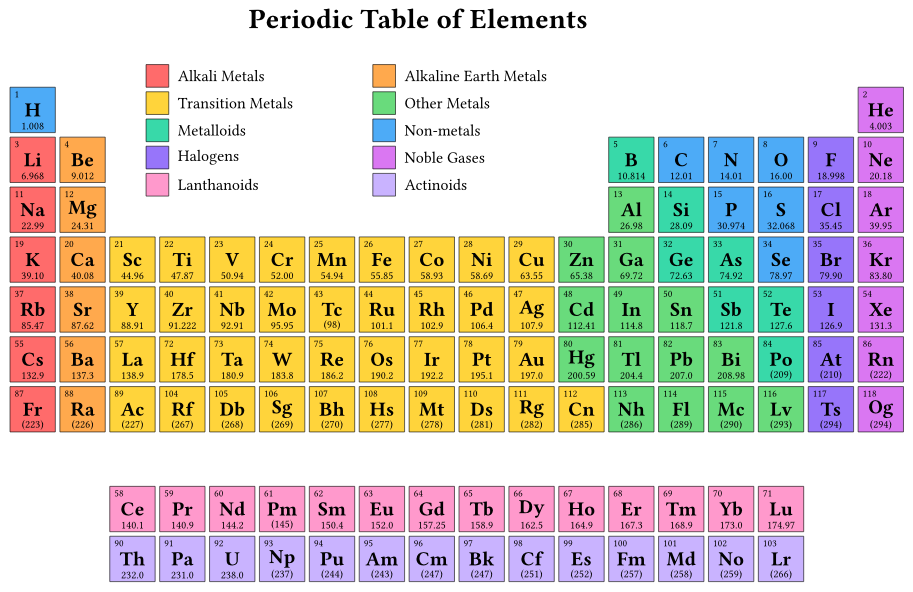
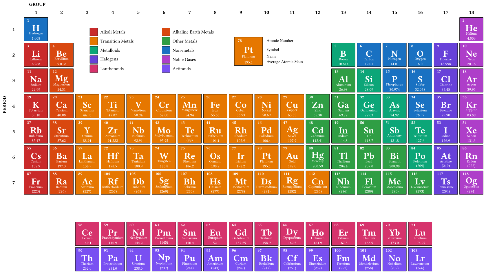

# Periodic Table for Typst

[](https://github.com/GiggleLiu/periodic-table/actions/workflows/test.yml)

A Typst package for rendering periodic tables of elements with two style options:

1. **`periodic-table()`** - Compact version for slides and handouts
2. **`periodic-table-detailed()`** - Professional ACS-style version with full details

## Installation

```typst
#import "@preview/periodic-table:0.1.0": periodic-table, periodic-table-detailed
```

Or for local use:

```typst
#import "lib.typ": periodic-table, periodic-table-detailed
```

## Usage

### Compact Version

```typst
#periodic-table()
```



With custom parameters:

```typst
#periodic-table(length: 0.8cm, size: 1.0, gap: 0.1)
```

### Detailed (ACS-style) Version

```typst
#periodic-table-detailed()
```



With custom parameters:

```typst
#periodic-table-detailed(length: 0.8cm, size: 1.8, gap: 0.15)
```

## Parameters

| Parameter | Default | Description |
|-----------|---------|-------------|
| `length` | `0.8cm` | Base length unit for the canvas |
| `size` | `1.0` (compact) / `1.8` (detailed) | Size of each element box |
| `gap` | `0.1` (compact) / `0.15` (detailed) | Gap between element boxes |

## Features

- All 118 elements with atomic numbers, symbols, names, and atomic masses
- Color-coded by element category (alkali metals, noble gases, etc.)
- Standard periodic table layout with lanthanoids and actinoids separated
- Built on the `cetz` package for high-quality vector graphics

## Dependencies

- [cetz](https://typst.app/universe/package/cetz) version 0.4.2

## License

MIT
